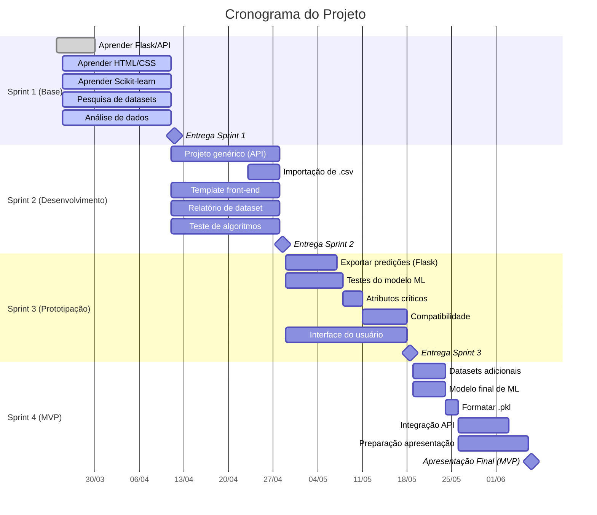

# 📊 Previsão de Cancelamento de Assinatura (Churn Prediction)

**Projeto desenvolvido para a Fábrica de Projetos Ágeis**  
*Alinhado às necessidades da Avivatec e disciplinas do curso*

---

## 🎯 Objetivo
Desenvolver um **algoritmo de IA** para categorizar clientes com base na probabilidade de cancelamento de assinaturas, permitindo que empresas criem ações personalizadas de retenção.

## 🔍 Problema
Dificuldade das empresas em reter clientes em modelos de negócio baseados em assinatura (*churn rate* elevado).

## ✨ Solução
- **Classificação automática** de clientes (alto/médio/baixo risco de cancelamento).  
- **Dashboard interativo** para visualização dos resultados.  
- **Integração com APIs** de CRM para ações proativas.  

---

## 🛠️ Tecnologias
| Área          | Ferramentas                 |
|---------------|-----------------------------|
| **Back-end**  | Python(Flask), Scikit-learn |
| **Front-end** | HTML/CSS, Bootstrap         |
| **Dados**     | Pandas, Numpy, R (análise)  |
| **DevOps**    | Git, GitHub                 |


## 📅 Cronograma (Gantt)



---


## 🚀 Próximos Passos
1. Finalizar pesquisa de datasets (Sprint 1).  
2. Desenvolver MVP com Flask + modelo preditivo (Sprint 2-3).  
3. Validar resultados com a Avivatec.  

---

## 📂 Estrutura do Repositório
```
/projeto-churn-prediction
├── /docs               # Documentação do projeto
├── /data               # Datasets e relatórios
├── /src                # Código-fonte
│   ├── /flask          # Back-end (Flask)
│   │    ├── /templates         
│   │    ├── /static    # CSS, Javascript
├── README.md           # Este arquivo
└── requirements.txt    # Dependências do Python
```

---


**Licença**: MIT  
**Contato**: [kobordias@email.com](#)
